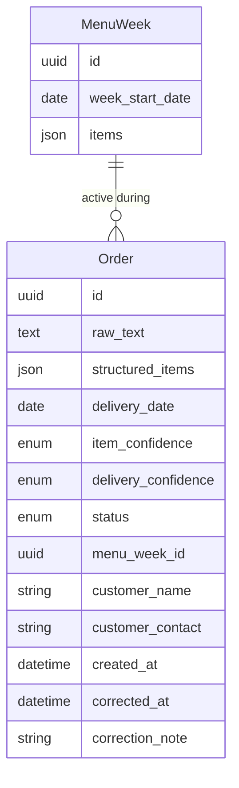

# AGENTS.md

## What this is

Family catering order system: replaces a manual WhatsApp + Excel
order-intake process. Two surfaces — a public free-text order form for
customers, and an admin dashboard for Dad (non-technical) showing raw
text + a structured parse of every order, with CSV export.

The hard part: the weekly menu changes and items mix and match in free
text, so orders can't be a dropdown. Free text is parsed into structured
data via the Claude API, not regex.

## Stack

- Frontend: Next.js (App Router), TypeScript, Tailwind CSS
- Backend: FastAPI (Python), SQLAlchemy, Alembic
- DB: PostgreSQL (Docker Compose locally)
- Parsing: Claude API, called server-side
- Local only for now — no deployment config unless asked.

## Commands

```
# backend
cd backend && uvicorn app.main:app --reload
cd backend && pytest
cd backend && alembic upgrade head

# frontend
cd frontend && npm run dev
cd frontend && npm run type-check
cd frontend && npm test
```

## Conventions

- Backend: type-hint everything, Pydantic schemas for all
  request/response bodies, business logic in `services/` not route
  handlers, no bare `except:`.
- Frontend: Server Components by default, Client Components only where
  interactive, no `any`, components under ~200 lines.
- Money: integer cents or `Decimal`, never float.
- Dates: store UTC, display local time.

## Non-negotiables

1. The customer's raw order text is never overwritten or deleted —
   always stored alongside the structured parse.
2. The parser never invents order items, quantities, or modifiers. If
   uncertain, it flags the order for manual review instead of guessing.
3. Admin auth: **shared PIN** via the `X-Admin-Pin` header, value from the
   `ADMIN_PIN` env var (default `1234` — change before real use). This was
   the product owner's explicit decision; not a real login — revisit if
   multiple staff or stronger auth become necessary.

## Data model (current)

```
Order: id, raw_text, structured_items (json), delivery_date,
       item_confidence, delivery_confidence, status
       (pending_parse | parsed | needs_review), menu_week_id (fk),
       customer_name, customer_contact, created_at, corrected_at,
       correction_note

MenuWeek: id, week_start_date, items (json)
```



## Working with this file

This file is always loaded into context — keep it lean. Domain-specific
detail (the full order-parsing contract) lives in
`.claude/skills/order-parsing/SKILL.md` instead, loaded only when
relevant.

Update this file after introducing a new concept, within the same
session. Add recurring mistakes here directly. Review periodically and
remove anything no longer accurate — a stale instruction is worse than
no instruction.
